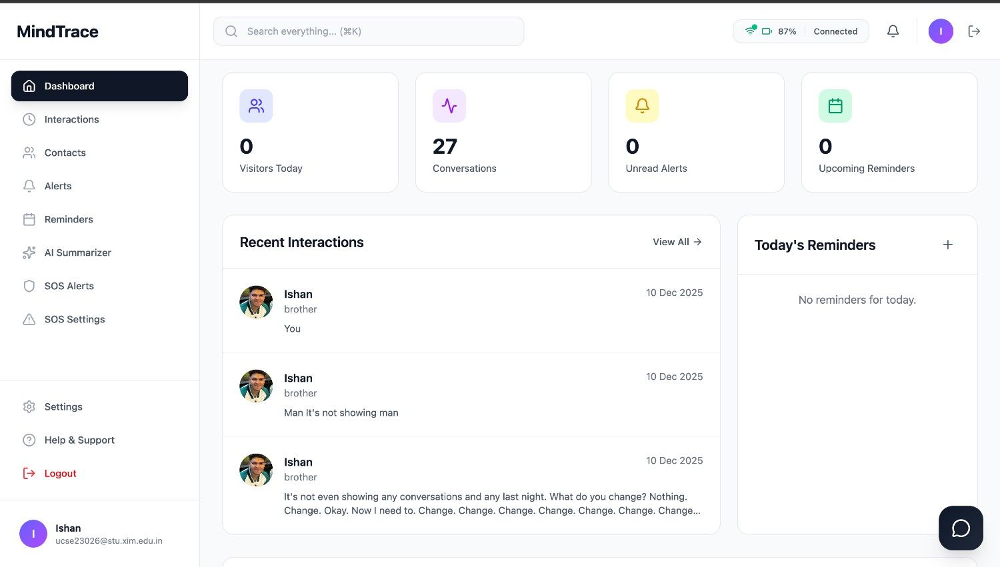
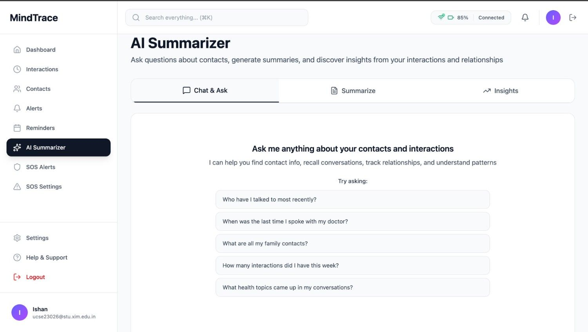
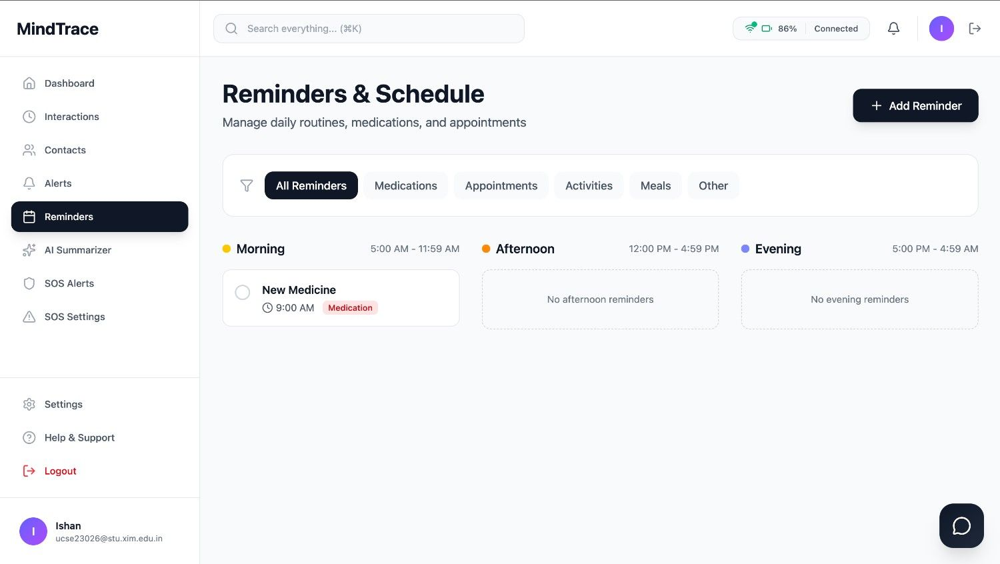
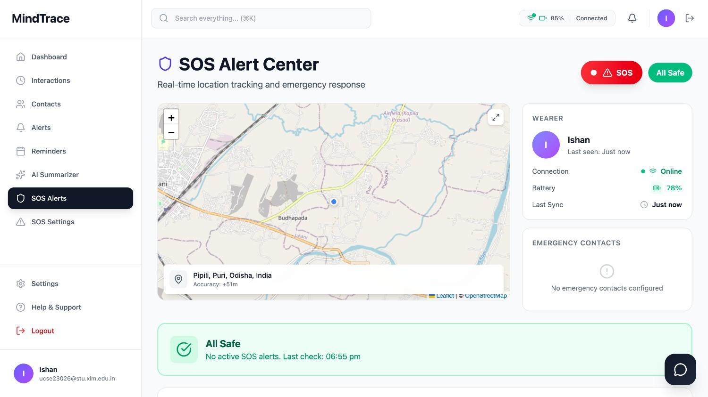
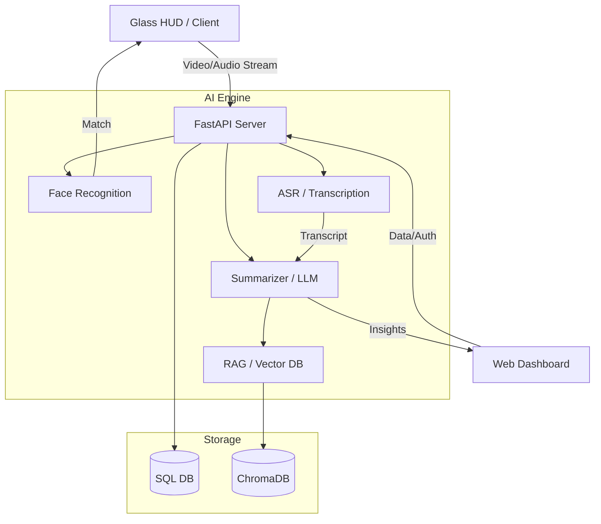

# 🧠 MindTrace

**A "Second Brain" for your glasses. Remember names, recall conversations, and track your social life.**

[](https://fastapi.tiangolo.com/)
[](https://reactjs.org/)
[](https://tailwindcss.com/)
[](https://deepmind.google/technologies/gemini/)
[](https://www.trychroma.com/)

---

## 🌟 What is MindTrace?

MindTrace is a tool to help you remember people and what you talked about. It uses a wearable HUD (like Meta Glass) to identify faces in real-time and a web dashboard to search through your past interactions. 

Basically, it's for when you forget names or need to remember that one thing someone mentioned three weeks ago.

---

## 📸 Screenshots

| **HUD Interface** | **Dashboard** |
| :---: | :---: |
|  |  |
| **AI Summarizer** | **Contact Directory** |
|  |  |
| **Smart Reminders** | **Advanced SOS** |
|  |  |

---

## 🏗️ The Setup

MindTrace is split into three parts:

### 1. 🖥️ Web Dashboard (`/client`)
A React 19 app to manage your contacts and see your stats.
- View contact history and relationship notes.
- Charts for social activity (built with Recharts).
- Interaction summaries.
- SOS/alert settings.

### 2. 🥽 Glass HUD (`/glass-client`)
The interface for wearable devices or mobile browsers.
- Fast face recognition.
- Real-time speech-to-text (ASR).
- Simple overlays to identify people instantly.

### 3. ⚙️ AI Backend (`/server`)
A FastAPI server that handles the heavy lifting:
- **InsightFace**: For face analysis and matching.
- **OpenAI Whisper**: Transcribes ambient audio.
- **RAG Engine**: Semantic search using ChromaDB and Google Gemini.
- **LangChain**: Connects the LLMs to your memory data.

---

## 🚀 Features

- **👁️ Face ID**: Matches faces against your contact list.
- **🎙️ Background Tracking**: Records and transcribes chats, then tags them to the right person.
- **🧠 Memory Search**: Search your history with natural language (e.g., "What did John say about his new job?").
- **📅 Auto-Reminders**: Creates tasks based on what people say (e.g., "Buy that book Sarah recommended").
- **🚨 SOS System**: Quick emergency alerts with location sharing.
- **📊 Social Stats**: Visualizes how often you're meeting people.

---

## 🛠️ Tech Stack

### Frontend
- **Framework**: React 19 + Vite
- **Styling**: Tailwind CSS 4
- **Motion**: Framer Motion + Lenis
- **Maps**: React Leaflet
- **Icons**: Lucide React

### Backend & AI
- **API**: FastAPI (Python 3.12)
- **DB**: SQLAlchemy + ChromaDB (Vector)
- **AI Models**: InsightFace, Faster Whisper, Google Gemini
- **Logic**: LangChain + ONNX Runtime

---

## 🧠 Model Details

For the technical specifics on how we tuned the models and why we picked them, check out **[MODELS.md](MODELS.md)**.

---

## 📐 Architecture



---

## 🏁 Getting Started

### Prerequisites
- Node.js 18+
- Python 3.10+
- [uv](https://docs.astral.sh/uv/) (Python package manager)
- Google Gemini API Key

### Quick Start

1. **Clone the repo**
   ```bash
   git clone https://github.com/yourusername/mindtrace.git
   cd mindtrace
   ```

2. **Run the Backend**
   ```bash
   cd server
   uv sync
   cp .env.example .env # Add your GEMINI_API_KEY
   uv run main.py
   ```

3. **Run the Dashboard**
   ```bash
   cd client
   npm install
   npm run dev
   ```

4. **Run the Glass HUD (Optional)**
   ```bash
   cd glass-client
   npm install
   npm run dev
   ```

---

## 📂 Folders

```text
MindTrace/
├── client/             # Web Dashboard (React)
├── glass-client/       # Wearable HUD
├── server/
│   ├── app/            # Routes & Logic
│   ├── ai_engine/      # FaceID, ASR, RAG
│   ├── data/           # Storage & DBs
│   └── main.py         # App Entry
├── screenshots/        # Images for README
├── QUICKSTART.md       # 10-min guide
├── API.md              # Endpoint docs
└── CONTRIBUTING.md     # How to contribute
```

---

## 📜 License

MIT License. See `LICENSE` for details.

---

<p align="center">
  Built for people who need a little help remembering.
</p>
